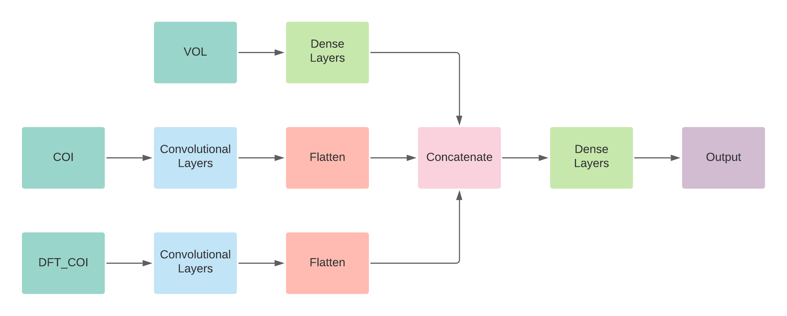

# Binary Classification of Blurred and Focused Images

The goal of this project is to distinguish between blurred and focused images.

For this classification task I have used two methods. One is using a CNN and the second is using a Support Vector 
Machine. The dataset used for this project can be found [here](https://mklab.iti.gr/results/certh-image-blur-dataset/).

Note: To use the Jupyter Notebook, please make a change in the excel files present in the EvaluationSet. Please rename 
the headings of the excel sheets to 'Image Name' and 'Blur Label'.

## Installation Guide

To install the required libraries for this project please use the following:

```
pip install -r requirements.txt
```

## The Convolutional Neural Network Approach

To train the CNN, I have mainly considered three features:

- A portion of the original image (COI): To obtain information regarding the image, we cut out a smaller part of the 
image from the center region and feed that to the CNN.
- 2D DFT of the COI (DFT_COI): Since the 2D DFT is a good indicator of prominent edges in the image, a 2D DFT seems like 
a good feature to use for the classification task.
- Variance of the Laplacian (VOL): The variance of the laplacian is also also passed on to the CNN as the VOL is a very
important parameter for identifying blurred images.

Now these three features are inputs to the CNN, and the output is just a single sigmoid activation neuron. If the output
is below 0.5 its considered as a focused image else a blurred image. The CNN can be visualised as follows:




### Accuracy of the model

The accuracy of the model on the training dataset is: 92.19 %
The accuracy of the model on the evaluation dataset is: 16.29 %

This shows that the model is overfitting on the training dataset. Moreover, we can also observe that the number of 
training images are less than the number of evaluation images. For a CNN it would be better if we had a lot more number 
of images to train the model on. 

Note: The trained CNN has been saved as an hdf5 file: `model_400.hdf5`.

## The Support Vector Machine Approach
  
To train the SVM I have considered two main features:

- The variance of the Laplacian.
- The maximum of the Laplacian.

### Accuracy of the model

The accuracy of the model on the training dataset is: 79.39 %
The accuracy of the model on the evaluation dataset is:  70.87 %

## Conclusion

From the above results we can observe that the SVM is performing better than the CNN. However, I believe that with a lot
more images, the CNN will outperform the SVM. 
